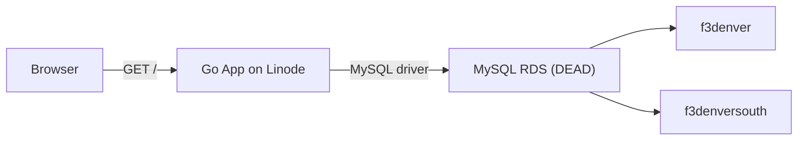
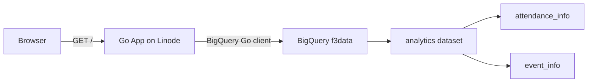

# Yeti Tracker: MySQL to BigQuery Migration

## Current Architecture



## Target Architecture



## Important: Cost Awareness

The `f3data` BigQuery project is owned by F3 Nation and shared with regions via the [F3 Data Analytics Google Group](https://groups.google.com/a/f3nation.com/g/f3-data-analytics). **Every query costs money.** The F3 Nation SOP explicitly warns against over-querying. This makes our existing caching architecture critical -- we must cache aggressively and avoid unnecessary queries.

## Step 0: Set Up Authentication (manual, guided)

Since `f3data` is F3 Nation's project (not yours), you cannot create service accounts. Instead, we use **Application Default Credentials (ADC)** with your Google account.

**On your local machine (for development):**

1. Install the `gcloud` CLI if not already installed: `curl https://sdk.cloud.google.com | bash`
2. Run: `gcloud auth application-default login`
3. Sign in with `weshayutin@gmail.com` in the browser that opens
4. This saves a refresh token to `~/.config/gcloud/application_default_credentials.json`
5. The BigQuery Go client automatically detects and uses this file

**On the Linode server (for production):**

1. SSH into the server: `ssh root@172.232.163.125`
2. Install `gcloud` CLI on the server
3. Run `gcloud auth application-default login --no-launch-browser`
4. Copy the URL it prints, open it in your local browser, sign in, paste the code back
5. The credentials file is saved at `~/.config/gcloud/application_default_credentials.json`
6. Mount this into the container (see Step 9)

The refresh token does not expire unless you change your Google password or explicitly revoke it.

## Step 1: Replace MySQL driver with BigQuery client

**File: [go.mod](go.mod)**

- Remove: `github.com/go-sql-driver/mysql` and `filippo.io/edwards25519`
- Add: `cloud.google.com/go/bigquery` (latest)
- Add: `google.golang.org/api` (pulled in transitively)

Run `go get cloud.google.com/go/bigquery` and `go mod tidy`.

## Step 2: Rewrite main.go -- connection setup

**File: [main.go](main.go)**

Replace the MySQL connection block (lines 52-77) with BigQuery client initialization:

- Remove `DB_HOST`, `DB_USER`, `DB_PASSWORD`, `DB_PORT`, `DB_NAME_NORTH`, `DB_NAME_SOUTH` env vars
- Add `BQ_PROJECT_ID` (default `f3data`) and `BQ_DATASET_ID` (default `analytics`)
- Authentication handled automatically via ADC (gcloud application-default credentials)
- Create client: `bigquery.NewClient(ctx, projectID)` -- picks up ADC automatically
- Update `App` struct: replace `*sql.DB` with `*bigquery.Client`, replace `DBNorth`/`DBSouth` with `ProjectID`/`DatasetID`

## Step 3: Rewrite the SQL query

**File: [handlers.go](handlers.go), `buildQuery()` function (lines 103-161)**

Replace the MySQL North/South UNION with a single BigQuery Standard SQL query:

```sql
SELECT
  e.region_name AS Region,
  FORMAT_DATE('%Y-%m-%d', e.start_date) AS Date,
  e.ao_name AS AO,
  a.f3_name AS PAX,
  CAST(a.user_id AS STRING) AS PAX_id,
  IFNULL(q.f3_name, '') AS Q,
  IFNULL(CAST(q.user_id AS STRING), '') AS Q_id
FROM `f3data.analytics.attendance_info` a
JOIN `f3data.analytics.event_info` e
  ON a.event_instance_id = e.id
LEFT JOIN (
  SELECT event_instance_id, f3_name, user_id
  FROM `f3data.analytics.attendance_info`
  WHERE q_ind = 1
) q ON a.event_instance_id = q.event_instance_id
WHERE e.region_name LIKE '%Denver%'
```

Key differences from MySQL:
- BigQuery uses backtick-quoted fully-qualified table names (`project.dataset.table`)
- Parameters use `@param` syntax, not `?` placeholders
- Date formatting uses `FORMAT_DATE` instead of implicit string conversion
- No `ActiveAO` concept -- we drop that filter (or derive it if needed later)
- `IFNULL` instead of relying on MySQL implicit NULL handling

## Step 4: Rewrite row scanning

**File: [handlers.go](handlers.go), `IndexHandler` (lines 286-356) and `PreWarmHistoricalCache` (lines 426-471)**

BigQuery uses an iterator pattern instead of `database/sql` rows:

- Use `client.Query(sql)` to create a query job
- Set `q.Parameters` for parameterized queries
- Call `q.Read(ctx)` to get an iterator
- Use `it.Next(&row)` with a struct or `[]bigquery.Value`
- Define a result struct with `bigquery` struct tags matching query column aliases

## Step 5: Simplify the data model

Since we're dropping South:

**File: [handlers.go](handlers.go)**

- Remove `NorthCount` / `SouthCount` from `PAXStats` struct (lines 72-73)
- Remove the `if row.Region == "North"` branching (lines 338-342, 453-457)
- Keep `Region` field in `AttendanceRow` but it will just reflect whatever `region_name` BigQuery returns

**File: [templates/index.html](templates/index.html)**

- Remove the North/South columns from the leaderboard table
- Simplify the region filter dropdown (remove North/South options, or repurpose for sub-region filtering)

## Step 6: Update DB status endpoint

**File: [handlers.go](handlers.go), `DBStatusHandler` (lines 528-541)**

BigQuery doesn't have `Ping()`. Replace with a lightweight metadata call or a simple `SELECT 1` query to verify connectivity.

## Step 7: Update configuration files

**File: [.env.example](.env.example)**

New env vars:
- `BQ_PROJECT_ID=f3data` (optional, defaults to `f3data`)
- `BQ_DATASET_ID=analytics` (optional, defaults to `analytics`)
- `REGION_FILTER=Denver` (optional, filters `region_name LIKE '%Denver%'`)
- Keep: `DEFAULT_START_DATE`, `DEFAULT_END_DATE`, `SERVER_PORT`, `CACHE_DIR`
- Remove: `DB_HOST`, `DB_USER`, `DB_PASSWORD`, `DB_PORT`, `DB_NAME_NORTH`, `DB_NAME_SOUTH`
- ADC credentials are auto-detected from `~/.config/gcloud/application_default_credentials.json` (no env var needed)

## Step 8: Update Dockerfile

**File: [Dockerfile](Dockerfile)**

No major changes needed. The BigQuery client is pure Go (no CGO), so `CGO_ENABLED=0` still works.

## Step 9: Update Linode deployment

**File: [linode/yeti-tracker.service](linode/yeti-tracker.service)**

- Update the `.env` file on Linode with the new env vars
- Run `gcloud auth application-default login --no-launch-browser` on the Linode server
- Mount the ADC credentials into the container: `-v /root/.config/gcloud/application_default_credentials.json:/root/.config/gcloud/application_default_credentials.json:ro`
- The BigQuery Go client auto-detects ADC from the well-known path

## Step 10: Test and validate

- Run locally with `go run .` against BigQuery
- Verify leaderboard data matches the cached data from the old MySQL app
- Verify filters (date range, PAX regex) work correctly
- Check the Yeti Beast badge logic still triggers correctly
- Build and push new container image
- Deploy to Linode and verify production

## Data mapping summary

- `attendance_info.f3_name` = PAX name
- `attendance_info.user_id` = PAX ID  
- `attendance_info.q_ind = 1` = this person was the Q for this event
- `attendance_info.event_instance_id` = FK to `event_info.id`
- `event_info.ao_name` = AO name
- `event_info.start_date` = workout date
- `event_info.region_name` = region (filter for Denver)

## Open question: ActiveAO

The old MySQL schema had `aos.archived` to flag inactive AOs. The BigQuery `event_info` table may not have this concept. Options:
- Drop the "Active AOs Only" filter entirely
- Derive it from recent activity (e.g., AOs with events in the last 90 days)
- Check if `ao_meta` JSON field contains an archived flag

We can decide during implementation after querying the data.

## Cost Optimization

Since every BigQuery query costs money (charged to the F3 Nation project), the app should query BigQuery **at most once per day**:

- **Daily refresh** -- add a background goroutine that queries BigQuery once per day (e.g., at 6:00 AM MT) and writes the result to disk cache. All HTTP requests serve from cache only.
- **Historical seasons never re-query** -- past seasons are immutable; serve from permanent disk cache forever.
- **Current season cache TTL = 24 hours** -- the daily refresh replaces the stale cache. If the cache is missing at startup, do one initial query and then switch to the daily schedule.
- **The DB status endpoint** should NOT run a BigQuery query. Instead, report whether the last daily refresh succeeded (timestamp + status flag in memory).
- **Manual refresh option** -- optionally expose a `/api/refresh` endpoint (admin-only or rate-limited) to force an early refresh if someone needs up-to-the-minute data.
- **No per-request queries** -- the current code queries BigQuery on every uncached HTTP request. This must change to always serve from cache, with only the daily background job touching BigQuery.

## Reference

- F3 Nation SOP: [F3 Nation Slack App SOP](https://docs.google.com/document/d/1e7tmuY3irKDt9oy1URQVcxPwxyet1ZY_bVZhGvhESEw)
- BigQuery console: [f3data project](https://console.cloud.google.com/bigquery?project=f3data)
- BigQuery access Google Group: [f3-data-analytics](https://groups.google.com/a/f3nation.com/g/f3-data-analytics)
- Shared queries are available in BigQuery under Queries > Shared Queries
- PAX Vault (for comparison/validation): [pax-vault.f3nation.com](https://pax-vault.f3nation.com)
- F3 Nation Stats: [stats.f3nation.com](https://stats.f3nation.com)
